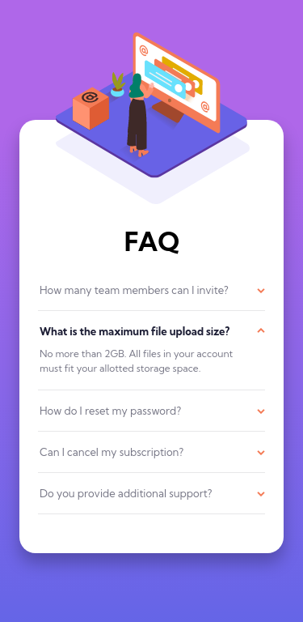
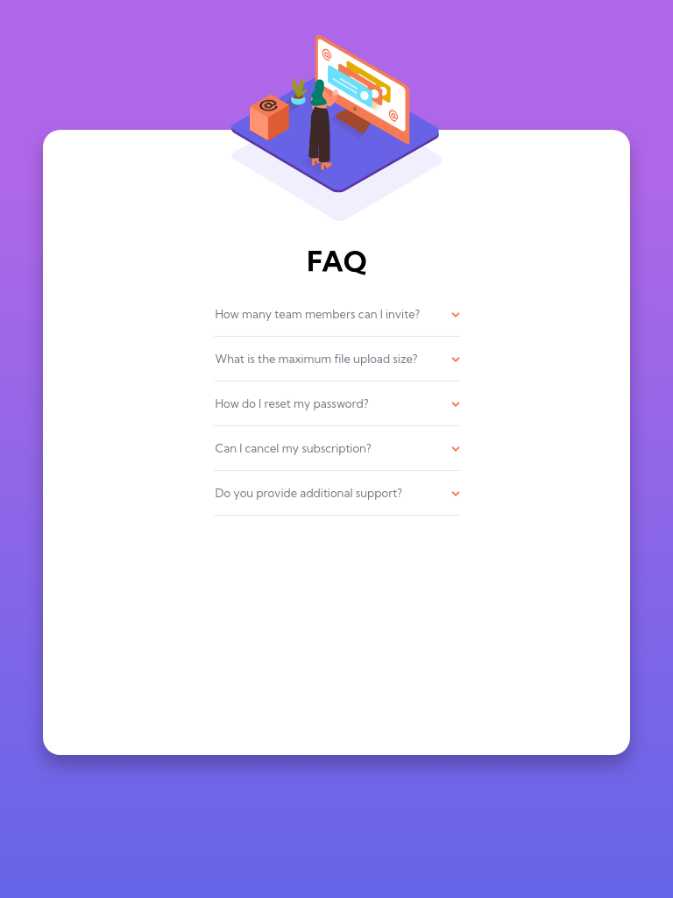
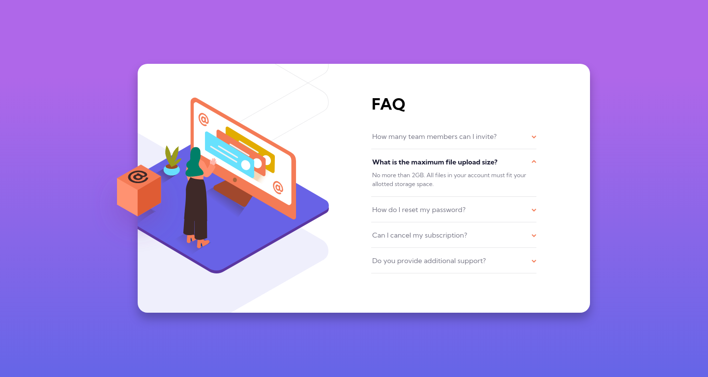
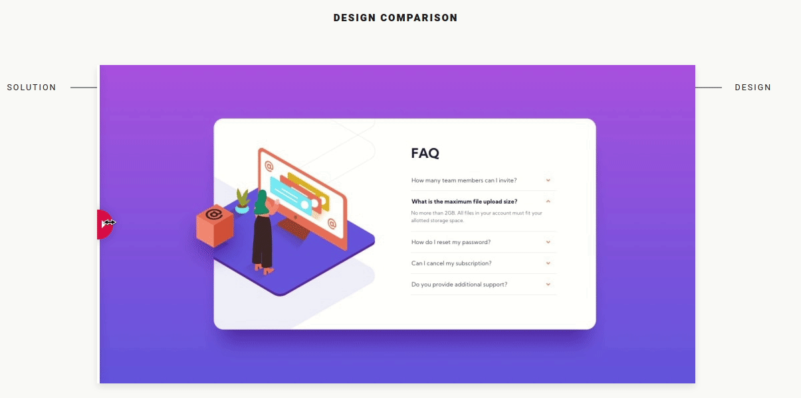

# Frontend Mentor - FAQ accordion card solution

This is a solution to the [FAQ accordion card challenge on Frontend Mentor](https://www.frontendmentor.io/challenges/faq-accordion-card-XlyjD0Oam). Frontend Mentor challenges help you improve your coding skills by building realistic projects.

## Table of contents

- [Overview](#overview)
  - [The challenge](#the-challenge)
  - [Screenshot](#screenshot)
  - [Links](#links)
- [My process](#my-process)
  - [Built with](#built-with)
  - [What I learned](#what-i-learned)
  - [Useful resources](#useful-resources)
- [Author](#author)

## Overview

This is the front-end mentor's Thirteenth challenge. The challenge is to build the "FAQ accordion card" and make it as close to the design as possible. Building the desing with whatever you want to finish, any language, framework or tools.

### The challenge

Users should be able to:

- View the optimal layout for the component depending on their device's screen size
- See hover states for all interactive elements on the page
- Hide/Show the answer to a question when the question is clicked

## Screenshot

### Mobile design

<p  align="center">
  </img>
</p>

### Tablets design

<p  align="center"></img></p>

### Desktop design

<p  align="center"></img></p>

<!--### result of my work

<p  align="center"></img></p> -->

### Links

<!-- - Solution URL: [My solution for this challenge](https://www.frontendmentor.io/solutions/single-price-grid-with-reactjs-YR5dhXAtZ)
- Live Site URL: [check the result](https://jcdmeira-single-price.netlify.app) -->

- My figma design: [Figma](https://www.figma.com/file/6MY1RKdWQ1fpoErizJxd6V/13-faq?node-id=0%3A1)

## My process

### Built with

- Mobile-first workflow
- [React](https://reactjs.org/) - JS library
- [Styled components](https://styled-components.com) - CSS in js with stiled components

### What I learned

I learned how to use colors assigned to global variables in global.js file, made with styled-components. And, in that way, access from anywhere in the code.
Colors are assigned using "export const GlobalStyle = createGlobalStyle``;" and are appended to the :root property, making it easy to use the colors and make future changes if necessary.

```JS
import { createGlobalStyle } from 'styled-components';

export const GlobalStyle = createGlobalStyle`
:root{
   // text - primary
    --desaturated-blue: #1D1E35;
    --soft-red: #F47C57;

    // text - neutral
    --very-dark-grayish-blue: #4A4B5E;
    --dark-grayish-blue:  #787887;

    // background gradient
    --soft-violet: #AF67E9;
    --soft-blue: #6565E7;
    --white: #FFF;

    // dividers
    --light-grayish-blue: #E7E7E9;
}
`;
```

I also learned that the key property is not passed to the component being called by the ".map" method, so it doesn't exist within the component in question, leading to errors.
The key property is just to mark the iterable as unique within the react environment.
And so, I learned that the '.map' method can aggregate several components with different information into a constant and then render.
UseState was also used to manage a state that reflects whether multiple Accordion calls are in open or closed state, with the isOpen property.
The property is internal to the component, and the state and the function of changing the state are passed to it.

```JSX
import React, { useState } from 'react';

// # My components
import { Accordion } from './components/Accordion/index.jsx';

// # data, faq question and answer
import { faqs } from './faqs';

function App() {
  const screenSize = window.screen.width;
  const [faqId, setFaqId] = useState(1);

  const Accordions = faqs.map((faq, index) => (
    <Accordion
      question={faq.q}
      answer={faq.a}
      key={index}
      myId={index}
      faqId={faqId}
      setFaqId={setFaqId}
    />
  ));
  return (
    <>
      {Accordions}
    </>
  );
}

export default App;
```

When the component is clicked, the react onClick synthetic event is triggered, triggering the handleClick function. That captures the event and makes the comparison if the current state of the question is equal to the state.
If so, we are clicking on an already open component, so we will close it, assigning null to the state.
If the case is different from the state, then we are clicking on a closed component, this way the id of that component will be assigned in the state, which will close the open component and open the one that was clicked.

The e.stopPropagation() method; is used to prevent propagation of the click event to other components, which would cause an external click action to trigger issues, leading to the closing of the newly opened component.

```JSX
import React from 'react';
import { AccordionContent } from './style';
import P from 'prop-types';

// # images
import arrow from '../../assets/images/icon-arrow-down.svg';

function Accordion({ question, answer, myId, faqId, setFaqId }) {
  const handleClick = (e) => {
    e.stopPropagation();
    myId === faqId ? setFaqId(null) : setFaqId(myId);
  };
  return (
    <AccordionContent
      arrowPath={arrow}
      isOpen={myId === faqId}
      onClick={handleClick}
    >
      <p className="question">{question}</p>
      <p className="answer">{answer}</p>
    </AccordionContent>
  );
}

Accordion.propTypes = {
  question: P.string.isRequired,
  answer: P.string.isRequired,
  myId: P.number.isRequired,
  faqId: P.number,
  setFaqId: P.func.isRequired,
};
export { Accordion };
```

The isOpen property is used as "short-circuit evaluation", which if true will do what is after the &&. Rotating the arrow image.

```JS
 :after {
      ${(props) => props.isOpen && 'transform: rotate(180deg);'};
      transition: all 0.3s ease-in;
      content: url(${(props) => props.arrowPath});
      position: absolute;
      right: 0;
    }
```

### Useful resources

- [react tutorial](https://pt-br.reactjs.org/tutorial/tutorial.html) - This helped me structure the components and build the proposed page.
- [my figma design](https://www.figma.com/file/6MY1RKdWQ1fpoErizJxd6V/13-faq?node-id=0%3A1) - My figma design for help anyone who wants to build this challenge.
- [CSS units conversor - px to VH/VW/REM](https://it-news.pw/pxtovh/) - CSS units conversor .
- [Converting Colors](https://convertingcolors.com) - HSL for all color systems.

## Author

- Personal Page - [Jean Carlos De Meira](https://jcdmeira.github.io)
- Frontend Mentor - [@JCDMeira](https://www.frontendmentor.io/profile/JCDMeira)
- Instagram - [@jean.meira10](https://www.instagram.com/jean.meira10/)
- GitHub - [JCDMeira](https://github.com/JCDMeira)
